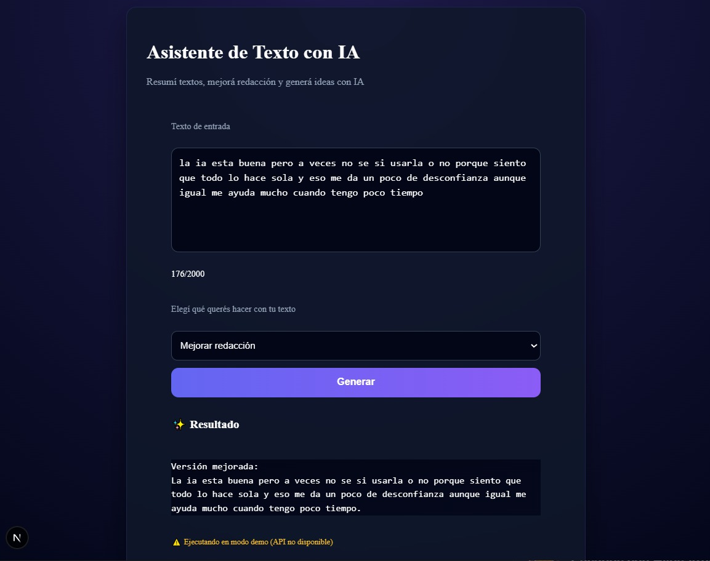

# 🧠 Asistente de Texto con IA

## Aplicación web que permite:

- Resumir texto 

- Mejorar redacción 

- Generar ideas creativas 

Incluye integración con OpenAI y un modo demo automático cuando la API no está disponible. 

## 📸 Vista previa

### Pantalla principal

### Resultado generado

## 🚀 Tecnologías utilizadas
 
- Next.js 

- React 

- TypeScript 

- OpenAI API 

- CSS  

## ⚙️ Cómo correr el proyecto localmente

### 1. Clonar el repositorio:

git clone <URL_DEL_REPO>

### 2. Instalar dependencias:

npm install

### 3. Crear un archivo `.env.local` en la raíz del proyecto y agregar:

OPENAI_API_KEY=tu_api_key_aqui

Esta es la única variable de entorno requerida por la aplicación.

⚠️ Si no se configura la API key o la cuota está excedida,  
la aplicación funcionará automáticamente en modo demo.

### 4. Ejecutar el servidor:

npm run dev

### 5. La aplicación estará disponible en:

http://localhost:3000

## 🏗️ Arquitectura

- Frontend en Next.js (App Router)
- API Route para comunicación con OpenAI
- Manejo de estados con React
- Fallback automático en caso de error (modo demo)